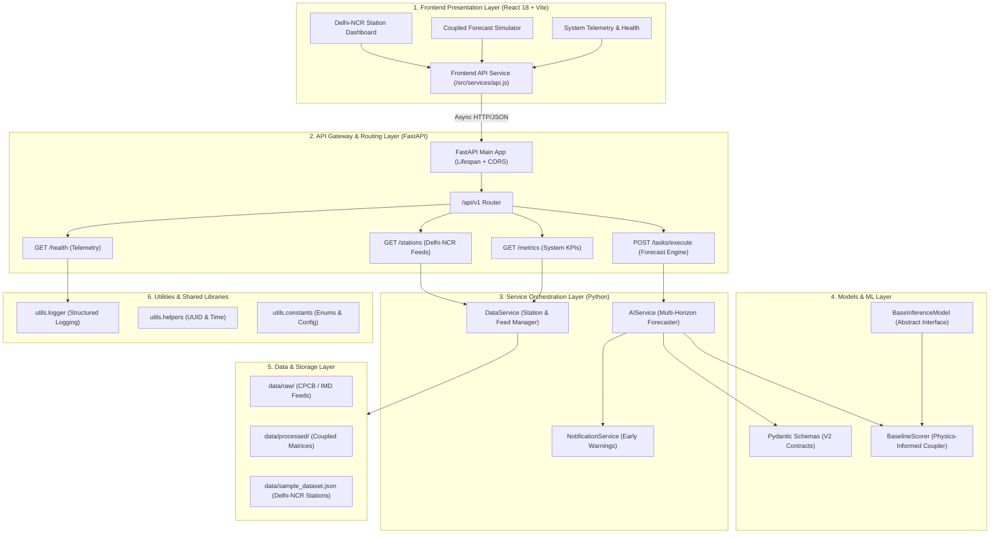

# PROJECT SPECIFICATION (MASTER REFERENCE)

**Project Title**: Air Pollution-Weather Coupled Forecasting System (Delhi-NCR)  
**Permanent Specification**: SIH Prototype Foundation  
**Version**: 1.0.0  
**Focus Region**: National Capital Region (Delhi-NCR), India  
**Status**: ACTIVE & LOCKED FOUNDATION

---

## 1. Executive Summary & Problem Definition

### 1.1 Context & Problem Statement
Severe air pollution in the National Capital Region (Delhi-NCR) is a critical seasonal and perennial public health emergency. The atmospheric crisis in Delhi-NCR is governed not merely by localized emissions (vehicular exhaust, industrial emissions, construction dust, agricultural stubble burning), but primarily by **dynamic meteorological coupling phenomena**:
* **Planetary Boundary Layer (PBL) Stagnation**: Rapid drop in boundary layer mixing height (often collapsing from >1500m during daytime to <350m at night/winter mornings) trapping particulate matter close to the ground.
* **Thermal Inversions**: Warm air layers capping colder surface air, preventing vertical dispersion.
* **Calm Surface Winds**: Surface wind velocities dropping below 6–8 km/h, preventing horizontal advection and dispersion.
* **High Relative Humidity & Secondary Aerosols**: Elevated humidity facilitating gas-to-particle conversion (NOx/SO2 to nitrates/sulfates).

### 1.2 The Core Limitation of Existing Solutions
Existing public air quality platforms predominantly display **current or historical AQI readings**. These static metrics inform citizens of past or existing toxicity without predictive foresight, preventing preemptive decision-making by regulators (e.g., Graded Response Action Plan / GRAP stages) and citizens.

### 1.3 Main Objective
**To forecast upcoming air-pollution levels by considering both pollution data and weather conditions, rather than only showing the current AQI.**

---

## 2. System Architecture & Modular Pillars

The platform is structured into six decoupled, modular layers:



---

## 3. Data Model & Meteorological Coupling Schema

### 3.1 Key Monitored Parameters
Every station observation in Delhi-NCR encapsulates two coupled data vectors:

1. **Pollutant Concentrations**:
   * $\text{PM}_{2.5}$ ($\mu\text{g/m}^3$)
   * $\text{PM}_{10}$ ($\mu\text{g/m}^3$)
   * $\text{NO}_2$ ($\mu\text{g/m}^3$)
   * $\text{CO}$ ($\text{mg/m}^3$)
   * Current Sub-Index & Calculated AQI
2. **Meteorological Parameters**:
   * Surface Temperature ($^\circ\text{C}$)
   * Relative Humidity ($\%$)
   * Wind Speed ($\text{km/h}$) & Wind Direction ($^\circ$)
   * Planetary Boundary Layer (PBL) Height ($m$)
   * **Ventilation Index ($V_i$)**: $V_i = \text{Wind Speed (m/s)} \times \text{PBL Height (m)}$

### 3.2 Air Quality Index (AQI) Classification (Indian National Standards)
* `0 - 50`: **GOOD**
* `51 - 100`: **SATISFACTORY**
* `101 - 200`: **MODERATE**
* `201 - 300`: **POOR**
* `301 - 400`: **VERY_POOR**
* `401 - 500+`: **SEVERE / SEVERE_PLUS**

---

## 4. API Endpoints Contract (v1)

| Endpoint | Method | Description | Request Body | Response Model |
| :--- | :--- | :--- | :--- | :--- |
| `/` | `GET` | Service metadata, objective, and root status | None | `JSONResponse` |
| `/api/v1/health` | `GET` | Health status, uptime, and sub-service matrix | None | `HealthResponse` |
| `/api/v1/stations` | `GET` | Active Delhi-NCR monitoring stations with coupled data | None | `List[StationObservation]` |
| `/api/v1/metrics` | `GET` | System operational metrics and 6-pillar latency matrix | None | `SystemMetrics` |
| `/api/v1/tasks/execute`| `POST`| Run coupled forecast simulation or model inference | `TaskRequest` | `TaskResponse` |
| `/api/v1/tasks/history`| `GET` | Retrieve recent forecast executions and advisories | Query: `limit` | `List[TaskResponse]` |
| `/api/v1/records` | `GET` | List raw and ingested data records from data layer | None | `List[DataRecord]` |

---

## 5. Machine Learning & Forecasting Logic

### 5.1 Abstract Model Interface (`BaseInferenceModel`)
Located in `models/ml_models.py`, all future models (XGBoost, LSTM, CNN-LSTM, Transformer, Graph Neural Networks) must subclass `BaseInferenceModel` and implement:
* `load_model(model_path: str) -> bool`
* `predict(input_features: Dict[str, Any]) -> Dict[str, Any]`

### 5.2 Atmospheric Coupling Heuristics (`BaselineScorer`)
The baseline model combines observed pollutant concentrations with atmospheric dispersion multipliers:
$$\text{Stagnation Multiplier} = 1.0 + \Delta_{\text{wind}} + \Delta_{\text{pbl}} + \Delta_{\text{humidity}}$$
* If Wind Speed $< 8.0\text{ km/h} \implies \Delta_{\text{wind}} = +0.25$
* If PBL Height $< 500\text{ m} \implies \Delta_{\text{pbl}} = +0.20$
* If Relative Humidity $> 75\% \implies \Delta_{\text{humidity}} = +0.15$
* Predicted 24h AQI and pollutant concentrations are projected dynamically alongside thermal inversion risk and GRAP stage alerts.

---

## 6. Directory Structure Blueprint

```
Six_warriors/
├── backend/                   # FastAPI Application Core
│   ├── api/
│   │   └── v1/
│   │       ├── endpoints/
│   │       │   ├── health.py     # System telemetry & service readiness
│   │       │   ├── overview.py   # Delhi-NCR station feeds & metrics
│   │       │   └── tasks.py      # Coupled forecast execution endpoint
│   │       └── router.py         # Aggregated v1 router
│   ├── config.py              # Pydantic settings & CORS policy
│   ├── main.py                # App entry point & lifespan handler
│   └── requirements.txt       # Backend dependencies
├── data/                      # Dataset Storage & Pipeline
│   ├── raw/                   # Raw CPCB/IMD stream intake (.gitkeep)
│   ├── processed/             # Engineered coupled matrices (.gitkeep)
│   ├── sample_dataset.json    # Delhi-NCR benchmark seed dataset
│   └── README.md              # Data layer architecture documentation
├── frontend/                  # React 18 + Vite Web Application
│   ├── src/
│   │   ├── components/
│   │   │   ├── DataViewer.jsx       # Delhi-NCR station observatories
│   │   │   ├── MetricCard.jsx       # Real-time KPI summary cards
│   │   │   ├── ModulesOverview.jsx  # 6-pillar coupled architecture
│   │   │   ├── Navbar.jsx           # Nav brand & status indicator
│   │   │   ├── SystemHealth.jsx     # System telemetry & service matrix
│   │   │   └── TaskRunner.jsx       # Coupled forecast simulation runner
│   │   ├── services/
│   │   │   └── api.js               # Frontend API client with fallback states
│   │   ├── App.jsx                  # Main dashboard layout & tabs
│   │   ├── index.css                # Glassmorphic CSS design system
│   │   └── main.jsx                 # React root entry point
│   ├── index.html             # Web template with SEO & Google Fonts
│   ├── package.json           # Frontend dependencies & scripts
│   └── vite.config.js         # Vite build & backend proxy
├── models/                    # ML / AI Models & Validation Schemas
│   ├── __init__.py            # Clean exports
│   ├── ml_models.py           # BaseInferenceModel & BaselineScorer
│   ├── schemas.py             # Pydantic v2 data models
│   └── README.md              # Models layer documentation
├── services/                  # Business Logic Layer
│   ├── __init__.py            # Clean exports
│   ├── ai_service.py          # Coupled forecasting engine
│   ├── data_service.py        # Station data ingestion & querying
│   ├── notification_service.py # Early warning dispatch
│   └── README.md              # Services layer documentation
├── utils/                     # Shared Utilities
│   ├── __init__.py            # Clean exports
│   ├── constants.py           # AppStatus, TaskStatus, AQICategory
│   ├── helpers.py             # Timestamp & UUID generator helpers
│   └── logger.py              # Structured logging utility
├── .gitignore                 # Python/Node/OS exclusions
├── PROJECT_SPEC.md            # Permanent Master Project Specification
└── README.md                  # Project overview & quickstart guide
```

---

## 7. Development Guidelines & Commit Checklist

1. **Schema Consistency**: Never bypass Pydantic validation when adding new endpoints. Add schemas in `models/schemas.py`.
2. **Thin Controllers**: Keep FastAPI endpoints in `backend/api/` thin; delegate all business logic to `services/`.
3. **Structured Logging**: Always use `utils.logger.setup_logger(name)` rather than plain `print()` statements.
4. **Meteorological Integrity**: When forecasting pollution levels, ensure weather features (wind speed, PBL, humidity) are always explicitly coupled into the prediction vector.
