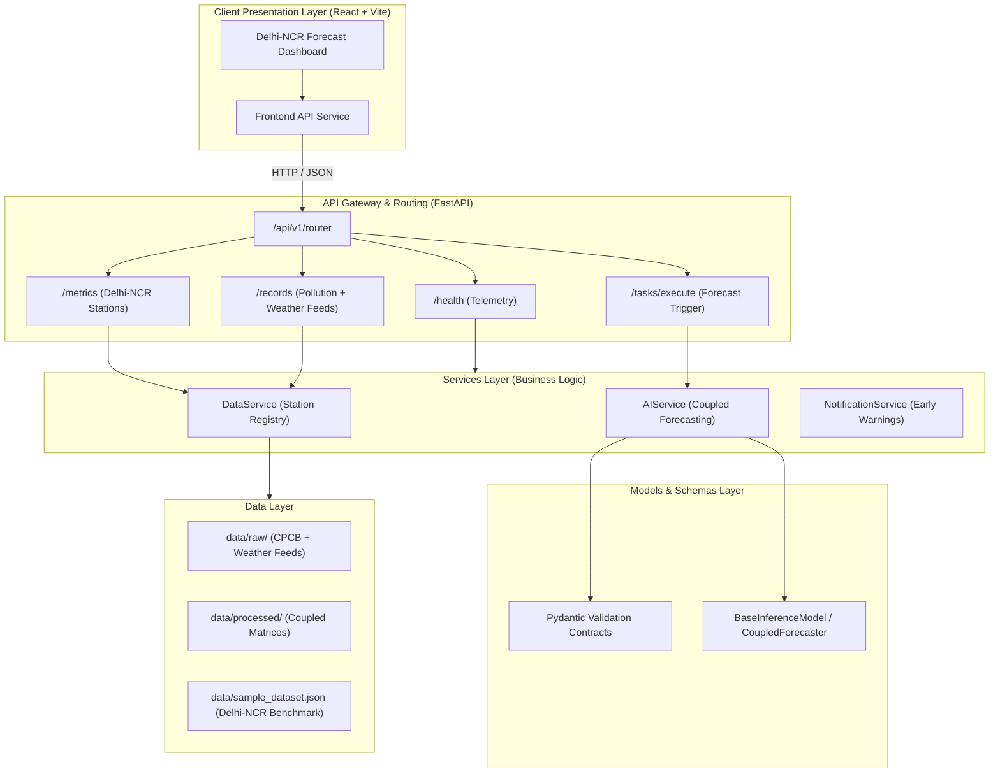

# Air Pollution-Weather Coupled Forecasting System (Delhi-NCR)

[](https://react.dev/)
[](https://fastapi.tiangolo.com/)
[](https://docs.pydantic.dev/)
[]()

---

## 📌 Problem Statement

### Air Pollution - Weather Coupled Forecasting System with a focus on Delhi-NCR

Air pollution in the National Capital Region (Delhi-NCR) is a severe seasonal and perennial crisis driven by a complex interplay of localized emissions (vehicular exhaust, industrial output, construction dust, biomass burning) and dynamic meteorological phenomena. 

Atmospheric factors—such as Planetary Boundary Layer (PBL) height, thermal inversion layers, low wind speeds, wind direction shifts, surface temperature gradients, and high relative humidity—heavily dictate pollutant dispersion, stagnation, and secondary aerosol formation. 

Existing public monitoring dashboards predominantly display **historical or current AQI measurements**, which merely report existing toxicity without predictive foresight. There is a critical necessity for an intelligent, predictive system that fuses **ambient pollutant concentrations (PM2.5, PM10, NO2, SO2, CO, O3)** with **numerical weather prediction parameters (wind vector, temperature, PBL height, humidity, precipitation probability)** to accurately forecast upcoming air pollution episodes.

---

## 🎯 Main Objective

To **forecast upcoming air-pollution levels by considering both pollution data and weather conditions, rather than only showing the current AQI.**

Key strategic goals include:
1. **Multi-Source Coupled Ingress**: Concurrently ingesting continuous ambient air quality data (e.g. CPCB/DPCC monitoring stations across Delhi-NCR) alongside high-resolution meteorological forecasts (IMD, ECMWF, GFS).
2. **Atmospheric Interaction Modeling**: Engineering physics-informed feature matrices capturing ventilation coefficients, stagnation indices, and inversion risks.
3. **Multi-Horizon Predictive Forecasting**: Generating 24-hour, 48-hour, and 72-hour AQI and pollutant concentration forecasts with quantified confidence intervals.
4. **Actionable Decision Support Dashboard**: Presenting proactive alerts, severity categorizations (Good, Moderate, Poor, Very Poor, Severe, Severe+), and intervention recommendations for environmental regulators and citizens.

---

## 🛠 Technology Stack

| Layer | Technologies & Frameworks | Description |
| :--- | :--- | :--- |
| **Frontend** | React 18, Vite, Lucide Icons, Vanilla CSS Design System | Modern SPA featuring Delhi-NCR station monitors, 24h forecast charts, weather-pollution correlation cards, and interactive pipeline triggers |
| **Backend** | FastAPI, Python 3.13, Uvicorn, Pydantic v2 | High-performance asynchronous REST API handling data ingestion, meteorological coupling, and forecast dispatch |
| **Data Layer** | JSON/CSV, Pandas, Raw/Processed Ingress Pipeline | Station registries (Anand Vihar, ITO, RK Puram, Punjabi Bagh, Dwarka), raw observation streams, and feature-engineered datasets |
| **AI / Models** | Scikit-Learn, Pydantic Schemas, Coupled Scorer (`BaselineScorer`) | Abstract inference interface (`BaseInferenceModel`) evaluating pollutant-weather matrices, ventilation coefficients, and AQI forecasts |
| **Services** | Python Service Orchestrators | Ingestion (`DataService`), Coupled AI Pipeline (`AIService`), and Environmental Early Warnings (`NotificationService`) |
| **Utilities** | Structured Logging, ISO Time Utilities, Constants | Centralized logging, UUID generators, and AQI severity level definitions |

---

## ✨ Main Features

* **🛰️ Coupled Weather & Pollution Telemetry**: Real-time monitoring of PM2.5, PM10, NO2 alongside Temperature, Relative Humidity, Wind Speed, and Boundary Layer Height.
* **🔮 Predictive Air Quality Forecasting**: 24h–72h predictive trajectory calculations taking into account wind dispersion and atmospheric stagnation.
* **🛡️ Modular 6-Pillar Architecture**:
  1. *Station Ingress*: Multi-station CPCB & IoT monitoring feed intake across Delhi-NCR.
  2. *Meteorological Coupling*: Real-time atmospheric normalization and ventilation index derivation.
  3. *AI Forecast Engine*: Multi-variate ML regression and deep learning inference shell.
  4. *Alert & Decision Dispatcher*: Proactive GRAP (Graded Response Action Plan) trigger recommendations.
  5. *Telemetry & Logger*: Systematic monitoring of data ingestion latency and pipeline health.
  6. *Validation & Boundaries*: Pydantic v2 schema validation for all meteorological and pollutant payloads.
* **📊 Station Registry & Data Explorer**: Live view of Delhi-NCR monitoring station feeds (Anand Vihar, ITO, RK Puram, etc.).
* **⚡ Interactive Forecast Trigger**: On-demand dispatch of coupled forecast simulations and anomaly detection.

---

## 🏛 Architecture Overview



---

## 📂 Project Structure

```
Six_warriors/
├── backend/                  # FastAPI Application Core
│   ├── api/
│   │   └── v1/
│   │       ├── endpoints/
│   │       │   ├── health.py    # Health & telemetry endpoint
│   │       │   ├── overview.py  # Delhi-NCR station metrics & data records
│   │       │   ├── risk.py      # Pollution risk & early warning assessment
│   │       │   └── tasks.py     # Coupled forecast pipeline execution
│   │       └── router.py        # Aggregated v1 API router
│   ├── config.py             # App configuration & CORS settings
│   ├── db/
│   │   └── supabase_client.py# Supabase PostgreSQL database client
│   ├── main.py               # FastAPI entry point & lifespan handler
│   ├── requirements.txt      # Python dependencies
│   └── services/
│       └── risk_service.py   # Multi-tier risk & meteorological analysis
├── data/                     # Dataset Storage & Pipeline
│   ├── raw/                  # Ingress directory for raw CPCB/weather feeds (.gitkeep)
│   ├── processed/            # Normalized coupled feature sets (.gitkeep)
│   ├── sample_dataset.json   # Delhi-NCR station observations
│   └── README.md             # Data layer guidelines
├── frontend/                 # React 18 + Vite Web Application
│   ├── src/
│   │   ├── components/
│   │   │   ├── DataViewer.jsx       # Delhi-NCR station observations viewer
│   │   │   ├── MetricCard.jsx       # KPI metric cards (AQI, PM2.5, Wind, PBL)
│   │   │   ├── ModulesOverview.jsx  # 6-pillar coupled architecture
│   │   │   ├── Navbar.jsx           # Brand nav & live status indicator
│   │   │   ├── SystemHealth.jsx     # Telemetry & service matrix
│   │   │   └── TaskRunner.jsx       # Coupled forecast execution trigger
│   │   ├── services/
│   │   │   └── api.js               # Frontend HTTP API client
│   │   ├── App.jsx                  # Main dashboard layout & tabs
│   │   ├── index.css                # Glassmorphic CSS design system
│   │   └── main.jsx                 # React root entry point
│   ├── index.html            # Web page template with SEO & fonts
│   ├── package.json          # Node dependencies & scripts
│   └── vite.config.js        # Vite build & proxy config
├── models/                   # Schemas & ML Model Abstractions
│   ├── __init__.py
│   ├── ml_models.py          # CoupledForecaster & BaseInferenceModel
│   ├── schemas.py            # Pydantic request/response schemas
│   └── README.md             # Models architecture guide
├── scripts/                  # Management & Database Scripts
│   ├── seed_database.py      # Supabase NCR stations & measurements seeder
│   └── check_schema.py       # Station & schema validation check
├── services/                 # Business Logic & Orchestration
│   ├── __init__.py
│   ├── ai_service.py         # Coupled forecasting engine
│   ├── data_service.py       # Live Supabase station ingestion & querying
│   ├── notification_service.py # Early warning dispatch
│   ├── risk_service.py       # Pollution risk assessment service alias
│   └── README.md             # Services layer guide
├── tests/                    # Comprehensive Test Suites
│   ├── test_backend_health.py# Route diagnostics & OpenAPI checks
│   └── test_risk_service.py  # 24-assertion coupled risk test suite
├── utils/                    # Shared Utilities
│   ├── __init__.py
│   ├── constants.py          # Status enums, AQI categories, constants
│   ├── helpers.py            # Timestamp & UUID generator helpers
│   └── logger.py             # Standard structured logging
├── .gitignore
└── README.md                 # Project documentation
```

---

## 🚀 Quickstart & Development Guide

### 1. Start FastAPI Backend

```powershell
# In project root directory
python -m uvicorn backend.main:app --host 127.0.0.1 --port 8000 --reload
```
* **API Server:** `http://127.0.0.1:8000`
* **Interactive Docs (Swagger UI):** `http://127.0.0.1:8000/docs`
* **Alternative Docs (ReDoc):** `http://127.0.0.1:8000/redoc`

### 2. Start React Frontend

```powershell
cd frontend
npm.cmd install
npm.cmd run dev
```
* **Web Dashboard:** `http://localhost:5173`
